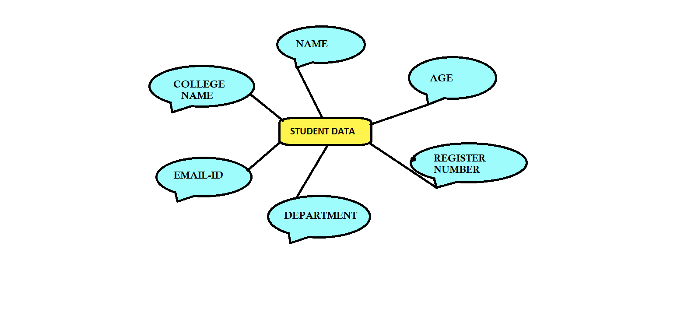
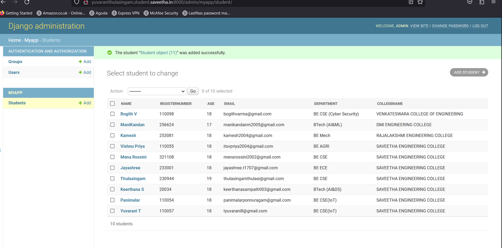

# Ex02 Django ORM Web Application

## AIM
To develop a Django application to store and retrieve data from a student database using Object Relational Mapping(ORM).

## Entity Relationship Diagram


## DESIGN STEPS

### STEP 1:
Clone the repository from the github.

### STEP 2:
Create an admin interface for django.

### STEP 3:
Create an app and edit settings.py.

### STEP 4:
Makemigrations and migrate the changes.

### STEP 5:
Create admin user with python code for admin and models.

### STEP 6:
Make all the migrations to my app.

### STEP 7:
Create a student database using runserver command.

## PROGRAM
```
admin.py

from django.contrib import admin
from .models import Stud,StudAdmin
admin.site.register(Stud,StudAdmin)

models.py

from django.db import models
from django.contrib import admin
class Stud (models.Model):
    name=models.CharField(max_length=100)
    registernumber=models.IntegerField()
    age=models.IntegerField()
    email=models.EmailField()
    department=models.CharField(max_length=50)
    collegename=models.CharField(max_length=100)
class StudAdmin(admin.ModelAdmin):
    list_display=('name','registernumber','age','email','department','collegename')

from django.contrib import admin
from .models import Stud,StudAdmin
admin.site.register(Stud,StudAdmin)
```

## OUTPUT


## RESULT

The program for creating a student database using the ORM is created successfully.